# ENTITY RELATIONSHIP DOCUMENT (ERD)

**Project:** Cloth Store E-Commerce Website  
**References:** RFP-CLOTH-ECOM-2026-001 · FDD v1.0  
**Version:** 1.0  
**Date:** June 25, 2026

---

## 1. Entity Overview

| # | Entity | Description |
|---|---|---|
| 1 | USER | Customers and admin staff |
| 2 | ADDRESS | Saved shipping/billing addresses |
| 3 | CATEGORY | Product category tree (self-referential) |
| 4 | PRODUCT | Core product record |
| 5 | PRODUCT_VARIANT | Size/color/material variant with its own SKU & stock |
| 6 | PRODUCT_IMAGE | Images linked to product or a specific variant |
| 7 | TAG | Collection/tag labels (e.g. "New Arrivals", "Sale") |
| 8 | PRODUCT_TAG | Product ↔ Tag join |
| 9 | REVIEW | Customer star rating + text for a product |
| 10 | CART | Active shopping session |
| 11 | CART_ITEM | Line item inside a cart |
| 12 | WISHLIST_ITEM | Saved variant per user |
| 13 | ORDER | Placed order record |
| 14 | ORDER_ITEM | Line item inside an order (snapshot of price at time of purchase) |
| 15 | ORDER_STATUS_HISTORY | Audit log of every status change |
| 16 | PAYMENT | Razorpay payment record |
| 17 | REFUND | Razorpay refund record |
| 18 | SHIPMENT | Shiprocket AWB and tracking |
| 19 | COUPON | Discount coupon definition |
| 20 | COUPON_USAGE | Which user used which coupon on which order |
| 21 | CAMPAIGN | Seasonal/flash sale campaign |
| 22 | CAMPAIGN_PRODUCT | Campaign ↔ Product join |
| 23 | ABANDONED_CART_EMAIL | Tracks which recovery emails were sent per cart |
| 24 | RESTOCK_ALERT | Guest/customer email waiting for a variant to be back in stock |
| 25 | BANNER | Homepage / category hero banners (CMS) |
| 26 | PAGE | Static CMS pages (About, Policy, T&C, etc.) |

---

## 2. ERD Diagram

```mermaid
erDiagram

    USER {
        int id PK
        string name
        string email
        string phone
        string password_hash
        enum role "customer | manager | inventory_staff | super_admin"
        bool email_verified
        bool phone_verified
        timestamp created_at
    }

    ADDRESS {
        int id PK
        int user_id FK
        string full_name
        string phone
        string line1
        string line2
        string city
        string state
        string pincode
        string label
        bool is_default
    }

    CATEGORY {
        int id PK
        int parent_id FK "null = root category"
        string name
        string slug
        string banner_image
        string meta_title
        string meta_description
        int display_order
        bool active
    }

    PRODUCT {
        int id PK
        int category_id FK
        string name
        string slug
        text short_description
        text full_description
        decimal base_price
        decimal sale_price "nullable"
        float gst_rate "0 | 5 | 12 | 18"
        enum status "draft | active | archived"
        string meta_title
        string meta_description
        timestamp created_at
    }

    PRODUCT_VARIANT {
        int id PK
        int product_id FK
        string sku
        string size
        string color
        string material
        decimal price_override "nullable; falls back to product base_price"
        int stock
        int low_stock_threshold
    }

    PRODUCT_IMAGE {
        int id PK
        int product_id FK
        int variant_id FK "nullable; null = shared across all variants"
        string url
        int display_order
        bool is_primary
    }

    TAG {
        int id PK
        string name
        string slug
    }

    PRODUCT_TAG {
        int product_id FK
        int tag_id FK
    }

    REVIEW {
        int id PK
        int product_id FK
        int user_id FK
        int rating "1-5"
        text body
        string photo_url "nullable"
        bool approved
        timestamp created_at
    }

    CART {
        int id PK
        int user_id FK "nullable; null = guest cart"
        string session_id "for guest carts"
        timestamp updated_at
    }

    CART_ITEM {
        int id PK
        int cart_id FK
        int variant_id FK
        int qty
    }

    WISHLIST_ITEM {
        int id PK
        int user_id FK
        int variant_id FK
        timestamp added_at
    }

    ORDER {
        int id PK
        int user_id FK "nullable; guest checkout"
        int address_id FK "snapshot stored separately on order"
        int coupon_id FK "nullable"
        string guest_email "nullable; for guest orders"
        decimal subtotal
        decimal discount
        decimal shipping_cost
        decimal gst_amount
        decimal total
        enum payment_method "razorpay | cod"
        enum status "placed | confirmed | processing | shipped | delivered | cancelled | return_requested | return_accepted | refunded"
        string invoice_url
        timestamp placed_at
    }

    ORDER_ITEM {
        int id PK
        int order_id FK
        int variant_id FK
        string product_name "snapshot"
        string variant_label "snapshot e.g. M / Red"
        int qty
        decimal unit_price "snapshot at time of purchase"
        float gst_rate "snapshot"
    }

    ORDER_STATUS_HISTORY {
        int id PK
        int order_id FK
        enum status
        string note "nullable"
        int changed_by FK "USER id; nullable for system events"
        timestamp changed_at
    }

    PAYMENT {
        int id PK
        int order_id FK
        string razorpay_order_id
        string razorpay_payment_id "nullable until captured"
        decimal amount
        enum status "pending | captured | failed"
        string method "upi | card | netbanking | wallet | cod"
        timestamp paid_at "nullable"
    }

    REFUND {
        int id PK
        int payment_id FK
        decimal amount
        string razorpay_refund_id
        enum status "initiated | processed | failed"
        timestamp initiated_at
    }

    SHIPMENT {
        int id PK
        int order_id FK
        string carrier
        string awb
        string tracking_url
        enum status "pending | shipped | in_transit | delivered | returned"
        timestamp shipped_at "nullable"
        timestamp delivered_at "nullable"
    }

    COUPON {
        int id PK
        string code
        enum type "percentage | flat"
        decimal value
        decimal min_cart_value
        int max_uses "nullable = unlimited"
        int uses_count
        bool stackable "can stack with product-level sale price"
        timestamp expires_at "nullable"
        bool active
    }

    COUPON_USAGE {
        int id PK
        int coupon_id FK
        int user_id FK "nullable for guest"
        int order_id FK
        timestamp used_at
    }

    CAMPAIGN {
        int id PK
        string name
        enum type "seasonal | flash_sale"
        enum discount_type "percentage | flat"
        decimal discount_value
        timestamp starts_at
        timestamp ends_at
        bool active
    }

    CAMPAIGN_PRODUCT {
        int campaign_id FK
        int product_id FK
    }

    ABANDONED_CART_EMAIL {
        int id PK
        int cart_id FK
        int email_seq "1 or 2"
        string email_sent_to
        timestamp sent_at
    }

    RESTOCK_ALERT {
        int id PK
        int variant_id FK
        string email
        bool notified
        timestamp created_at
    }

    BANNER {
        int id PK
        string title
        string image_url
        string cta_link
        int display_order
        date active_from "nullable"
        date active_to "nullable"
        bool active
    }

    PAGE {
        int id PK
        string slug "about | contact | shipping-returns | privacy | terms"
        string title
        text body
        string meta_title
        string meta_description
        timestamp updated_at
    }

    %% ── Relationships ──────────────────────────────────────────

    USER ||--o{ ADDRESS              : "has"
    USER ||--o{ ORDER                : "places"
    USER ||--o{ REVIEW               : "writes"
    USER ||--o{ WISHLIST_ITEM        : "saves"
    USER ||--o| CART                 : "has active cart"
    USER ||--o{ COUPON_USAGE         : "uses"

    CATEGORY ||--o{ CATEGORY         : "parent of"
    CATEGORY ||--o{ PRODUCT          : "contains"

    PRODUCT ||--o{ PRODUCT_VARIANT   : "has variants"
    PRODUCT ||--o{ PRODUCT_IMAGE     : "has images"
    PRODUCT ||--o{ PRODUCT_TAG       : "tagged via"
    PRODUCT ||--o{ REVIEW            : "receives"
    PRODUCT ||--o{ CAMPAIGN_PRODUCT  : "featured in"

    TAG ||--o{ PRODUCT_TAG           : "used in"

    PRODUCT_VARIANT ||--o{ CART_ITEM      : "in carts"
    PRODUCT_VARIANT ||--o{ ORDER_ITEM     : "in orders"
    PRODUCT_VARIANT ||--o{ WISHLIST_ITEM  : "wishlisted"
    PRODUCT_VARIANT ||--o{ RESTOCK_ALERT  : "watched by"
    PRODUCT_VARIANT }o--o| PRODUCT_IMAGE  : "has specific images"

    CART ||--o{ CART_ITEM            : "contains"
    CART ||--o{ ABANDONED_CART_EMAIL : "triggers"

    ORDER ||--o{ ORDER_ITEM          : "contains"
    ORDER ||--o{ ORDER_STATUS_HISTORY: "logged by"
    ORDER ||--o| PAYMENT             : "paid via"
    ORDER ||--o| SHIPMENT            : "shipped via"
    ORDER }o--o| COUPON              : "applies"
    ORDER ||--o{ COUPON_USAGE        : "records coupon use"

    PAYMENT ||--o{ REFUND            : "refunded by"

    COUPON ||--o{ COUPON_USAGE       : "tracked by"

    CAMPAIGN ||--o{ CAMPAIGN_PRODUCT : "applies to"
```

---

## 3. Key Design Decisions

| Decision | Rationale |
|---|---|
| `ORDER_ITEM` stores snapshot fields (`product_name`, `unit_price`, `gst_rate`) | Product prices change over time; order history must be immutable |
| `CART.user_id` is nullable | Supports guest carts (keyed by `session_id`); merged on login |
| `CATEGORY` self-references `parent_id` | Covers unlimited depth (root → category → sub-category) without a separate join table |
| `PRODUCT_IMAGE.variant_id` is nullable | An image with `variant_id = null` is shared; one with a variant_id is variant-specific |
| `COUPON_USAGE` is a separate table | Enforces per-user use limits and provides a full audit trail |
| `CAMPAIGN_PRODUCT` join table | One campaign can cover many products; one product can be in many campaigns |
| `ORDER_STATUS_HISTORY.changed_by` nullable | System events (webhook callbacks) have no user actor |
| `PAYMENT` and `ORDER` are separate | A single order could theoretically have a retry payment; keeps payment gateway data cleanly isolated |

---

## 4. Enum Reference

| Enum | Values |
|---|---|
| `USER.role` | `customer`, `inventory_staff`, `manager`, `super_admin` |
| `PRODUCT.status` | `draft`, `active`, `archived` |
| `ORDER.status` | `placed`, `confirmed`, `processing`, `shipped`, `delivered`, `cancelled`, `return_requested`, `return_accepted`, `refunded` |
| `ORDER.payment_method` | `razorpay`, `cod` |
| `PAYMENT.status` | `pending`, `captured`, `failed` |
| `REFUND.status` | `initiated`, `processed`, `failed` |
| `SHIPMENT.status` | `pending`, `shipped`, `in_transit`, `delivered`, `returned` |
| `COUPON.type` | `percentage`, `flat` |
| `CAMPAIGN.type` | `seasonal`, `flash_sale` |
| `CAMPAIGN.discount_type` | `percentage`, `flat` |

---

*ERD v1.0 — Derived from RFP-CLOTH-ECOM-2026-001 and FDD v1.0 — June 25, 2026*  
*Update when schema changes are agreed in writing.*
