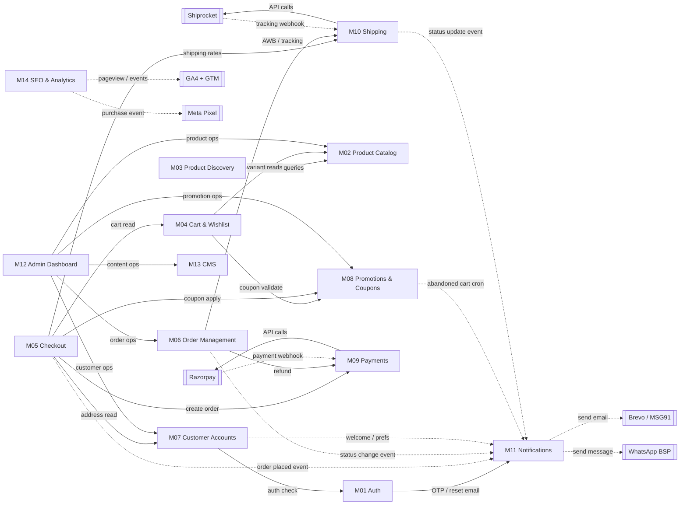
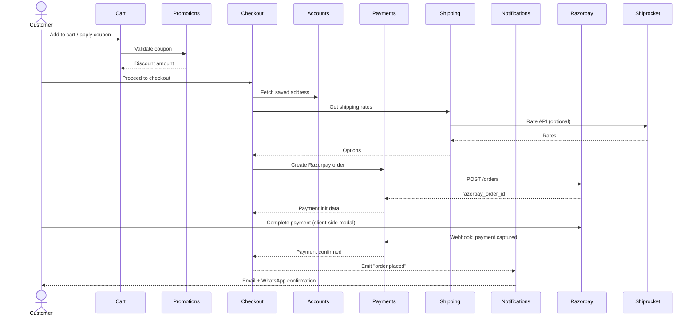
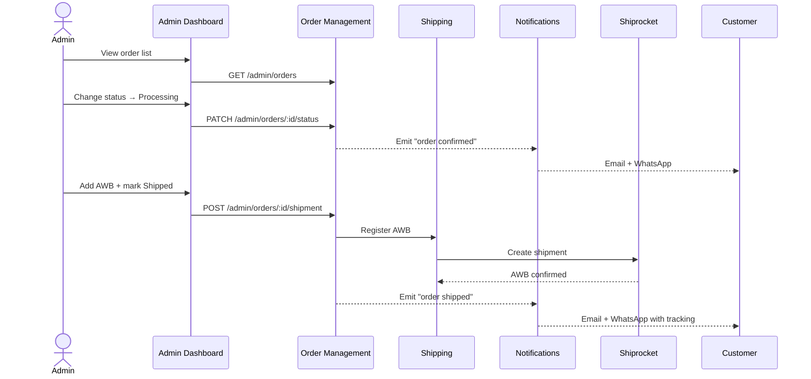
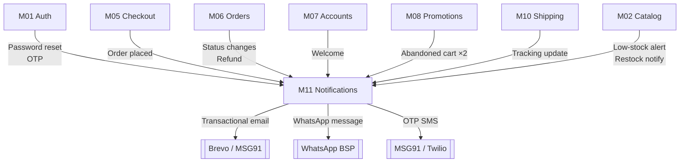

# MODULE DEPENDENCY MAP

**Project:** Cloth Store E-Commerce Website  
**References:** MODULE_MAP v1.0 · FDD v1.0  
**Version:** 1.0  
**Date:** June 25, 2026

> **How to read this document**  
> Solid arrow `→` = synchronous call (blocking, in-request).  
> Dashed arrow `-.->` = asynchronous / event-driven (queue, webhook, cron).  
> Box with double border `[[ ]]` = external third-party service.

---

## 1. Dependency Classification

| Module | Type | In-Degree¹ | Out-Degree² | Role |
|---|---|---|---|---|
| M01 Auth | Shared | 2 (M05, M07) | 1 (M11) | Gateway |
| M02 Product Catalog | Leaf | 2 (M03, M12) | 0 | Leaf |
| M03 Product Discovery | Near-Leaf | 1 (M12) | 1 (M02) | Thin wrapper |
| M04 Cart & Wishlist | Mid | 3 (M05, M12) | 2 (M02, M08) | Mid |
| M05 Checkout | Orchestrator | 1 (User) | 6 (M04 M07 M08 M09 M10 M11) | Orchestrator |
| M06 Order Management | Orchestrator | 2 (M05, M12) | 3 (M09 M10 M11) | Orchestrator |
| M07 Customer Accounts | Mid | 2 (M05, M12) | 2 (M01, M11) | Mid |
| M08 Promotions | Mid | 3 (M04 M05 M12) | 1 (M11) | Mid |
| M09 Payments | Service | 2 (M05, M06) | 1 (Razorpay) | External wrapper |
| M10 Shipping | Service | 2 (M05, M06) | 1 (Shiprocket) | External wrapper |
| M11 Notifications | Sink | 7 (all callers) | 3 (Brevo MSG91 WA) | Sink |
| M12 Admin Dashboard | Admin Orchestrator | 0 | 6 (M02 M06 M07 M08 M13) | Admin hub |
| M13 CMS | Leaf | 1 (M12) | 0 | Leaf |
| M14 SEO & Analytics | Cross-cutting | 0 | 3 (GA4 GTM Pixel) | Client-side only |

¹ _In-degree: how many modules call this one_  
² _Out-degree: how many modules this one calls_

---

## 2. Full Dependency Graph



---

## 3. Layer-by-Layer Diagrams

### 3a. Customer Purchase Flow (runtime call chain)



### 3b. Admin Order Fulfilment Flow



### 3c. Notification Fan-Out (all callers → M11)



---

## 4. Topological Build Order

No circular dependencies. Safe build/deployment sequence:

```
Level 0 — No dependencies (build first)
  M02  Product Catalog
  M13  CMS
  M14  SEO & Analytics (client-side)

Level 1 — Depend only on Level 0
  M03  Product Discovery        (→ M02)
  M09  Payments                 (→ Razorpay only)
  M10  Shipping                 (→ Shiprocket only)
  M11  Notifications            (→ external providers only)

Level 2 — Depend on Level 0–1
  M01  Auth                     (→ M11)
  M08  Promotions               (→ M11)

Level 3 — Depend on Level 0–2
  M04  Cart & Wishlist          (→ M02, M08)
  M07  Customer Accounts        (→ M01, M11)

Level 4 — Depend on Level 0–3
  M05  Checkout                 (→ M04, M07, M08, M09, M10, M11)
  M06  Order Management         (→ M09, M10, M11)

Level 5 — Depend on Level 0–4
  M12  Admin Dashboard          (→ M02, M06, M07, M08, M13)
```

> **Rule:** During development, start at Level 0 and work down. A module can be developed and tested in isolation as soon as its dependencies' APIs are stubbed/mocked.

---

## 5. Failure Impact Analysis

What degrades or breaks when a module/service is unavailable:

| Unavailable | Impacted Modules | Customer Impact | Admin Impact |
|---|---|---|---|
| M01 Auth | M07, M05 (logged-in flow) | Cannot log in / register; guest checkout still works | Cannot access admin panel |
| M02 Product Catalog | M03, M04, M12 | No product browsing | Cannot manage products |
| M09 Payments (Razorpay) | M05, M06 | Razorpay checkout fails; **COD still works** | Cannot process refunds |
| M10 Shipping (Shiprocket) | M05, M06 | Real-time rates unavailable → falls back to flat rates; no AWB auto-creation | Manual AWB entry required |
| M11 Notifications | M01, M05, M06, M07, M08 | No emails / WhatsApp; orders still process; OTP login fails | No low-stock alerts |
| M08 Promotions | M04, M05 | Coupons cannot be applied; cart total shows without discount | Cannot create/edit campaigns |
| M13 CMS | M12 | Static pages return cached content; banners may not refresh | Cannot edit pages/banners |
| Razorpay (external) | M09 | Online payment broken; COD path unaffected | — |
| Shiprocket (external) | M10 | Rate API → flat-rate fallback; tracking page shows last cached status | AWB auto-creation fails |
| Brevo / MSG91 (external) | M11 | Emails / OTPs not delivered; orders complete but silent | Admin alerts silent |
| WhatsApp BSP (external) | M11 | WhatsApp notifications fail; emails still sent | — |

---

## 6. Shared Data Contracts (inter-module interfaces)

Modules communicate via these shared structures. Changes here require coordination.

| Contract | Produced By | Consumed By | Key Fields |
|---|---|---|---|
| `CartSummary` | M04 | M05, M08 | items[], subtotal, coupon_id, discount |
| `OrderPayload` | M05 | M06, M09 | order_id, amount_paise, line_items[], address |
| `PaymentResult` | M09 | M05, M06 | razorpay_payment_id, status, method |
| `ShippingOption` | M10 | M05 | carrier, cost, estimated_days |
| `ShipmentRecord` | M10 | M06, M11 | awb, tracking_url, status |
| `NotificationEvent` | M05, M06, M07, M08, M10 | M11 | event_type, recipient{email,phone}, variables{} |
| `CouponValidation` | M08 | M04, M05 | valid, discount_amount, error_message |
| `UserSession` | M01 | All protected routes | user_id, role, exp |

---

## 7. Circular Dependency Check

```
M01 → M11 → (external only) ✓
M04 → M08 → M11 → (external only) ✓
M05 → M04 → M02 → (leaf) ✓
M05 → M09 → Razorpay → M09 (webhook) → M05 ← via event, not sync call ✓
M06 → M10 → Shiprocket → M10 (webhook) → M06 ← via event, not sync call ✓
```

**No circular synchronous dependencies.** Webhook re-entry points (Razorpay → M09, Shiprocket → M10) are async and handled via dedicated webhook endpoints, not back-calls into the originating module.

---

*Module Dependency Map v1.0 — June 25, 2026*  
*Cross-reference: MODULE_MAP_Cloth_Store_Website.md §4 for the flat dependency matrix.*
