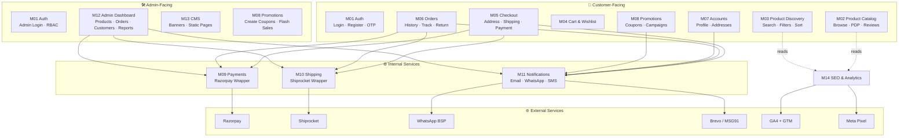

# MODULE MAP

**Project:** Cloth Store E-Commerce Website  
**References:** RFP-CLOTH-ECOM-2026-001 · FDD v1.0 · ERD v1.0  
**Version:** 1.0  
**Date:** June 25, 2026

---

## 1. Module Inventory (Quick Reference)

| # | Module | Layer | External Service |
|---|---|---|---|
| M01 | Auth | Shared (Customer + Admin) | — |
| M02 | Product Catalog | Customer-facing | — |
| M03 | Product Discovery | Customer-facing | — |
| M04 | Cart & Wishlist | Customer-facing | — |
| M05 | Checkout | Customer-facing | Razorpay, Shiprocket |
| M06 | Order Management | Customer-facing + Admin | Razorpay (refund), Shiprocket |
| M07 | Customer Accounts | Customer-facing | — |
| M08 | Promotions & Coupons | Customer-facing + Admin | — |
| M09 | Payments | Internal service | Razorpay |
| M10 | Shipping | Internal service | Shiprocket |
| M11 | Notifications | Internal service | Brevo/MSG91, WhatsApp BSP |
| M12 | Admin Dashboard | Admin-facing | — |
| M13 | CMS | Admin-facing | — |
| M14 | SEO & Analytics | Cross-cutting | GA4, GTM, Meta Pixel |

---

## 2. High-Level Architecture Diagram

---

## 3. Module Detail Breakdown

---

### M01 — Auth

**Purpose:** Registration, login, session management, password reset, phone OTP. Shared by customer and admin layers with different role checks.

| Sub-module | Detail |
|---|---|
| Customer registration | Email + password OR phone + OTP |
| Customer login | Email/password; session token issued |
| Admin login | Email/password; role checked against `USER.role` |
| Phone OTP | Send via MSG91/Twilio; 5-min TTL; rate-limited to 5/hour |
| Forgot password | Email magic link; 15-min TTL |
| Session | JWT access token (15 min) + refresh token (30 days, httpOnly cookie) |
| RBAC | Role from `USER.role`; enforced as middleware on every protected route |

**Routes (Customer)**

| Method | Path | Description |
|---|---|---|
| POST | `/api/auth/register` | Email/password registration |
| POST | `/api/auth/register/otp` | Phone OTP request |
| POST | `/api/auth/register/otp/verify` | OTP verification + account creation |
| POST | `/api/auth/login` | Login; returns tokens |
| POST | `/api/auth/logout` | Revoke refresh token |
| POST | `/api/auth/password/forgot` | Send reset link |
| POST | `/api/auth/password/reset` | Apply new password |
| POST | `/api/auth/token/refresh` | Refresh access token |

**Routes (Admin)**

| Method | Path | Description |
|---|---|---|
| POST | `/api/admin/auth/login` | Admin login |
| POST | `/api/admin/auth/logout` | Revoke session |

**DB Entities:** `USER`  
**External:** MSG91 / Twilio (OTP SMS), Brevo (password reset email)

---

### M02 — Product Catalog

**Purpose:** Serve the product browsing experience — category listings, PDPs, reviews, and inventory-aware variant display.

| Sub-module | Detail |
|---|---|
| Category tree | Recursive parent→child; cached |
| Product listing | Paginated; reads from M03 for filters |
| Product detail page | Variant selection, images, GST price, stock status |
| Reviews | Submit, paginated fetch; admin approval gate |
| Restock alerts | "Notify Me" email capture for OOS variants |

**Routes (Public)**

| Method | Path | Description |
|---|---|---|
| GET | `/api/categories` | Full category tree |
| GET | `/api/categories/:slug/products` | Paginated listing with filter/sort params |
| GET | `/api/products/:slug` | Product detail + variants + images |
| GET | `/api/products/:id/reviews` | Paginated reviews |
| POST | `/api/products/:id/reviews` | Submit review (auth required) |
| POST | `/api/restock-alerts` | Capture email for OOS variant |

**DB Entities:** `CATEGORY`, `PRODUCT`, `PRODUCT_VARIANT`, `PRODUCT_IMAGE`, `TAG`, `PRODUCT_TAG`, `REVIEW`, `RESTOCK_ALERT`

---

### M03 — Product Discovery

**Purpose:** Full-text search, faceted filtering, autocomplete. Reads same `PRODUCT` / `PRODUCT_VARIANT` tables; may use a search index (e.g., PostgreSQL full-text or Meilisearch) for speed.

| Sub-module | Detail |
|---|---|
| Search | Full-text across name, description, tags |
| Autocomplete | Top 5 results, debounced 300 ms |
| Filters | Price range, size, color, material, occasion, brand, on-sale |
| Sort | Relevance, price asc/desc, newest, bestsellers, rating |

**Routes (Public)**

| Method | Path | Description |
|---|---|---|
| GET | `/api/search?q=&page=` | Full search results |
| GET | `/api/search/autocomplete?q=` | Autocomplete suggestions |

**DB Entities:** `PRODUCT`, `PRODUCT_VARIANT`, `TAG`, `PRODUCT_TAG`  
**Note:** Filter params are query-string decorators on the M02 listing route; autocomplete is a dedicated lighter endpoint.

---

### M04 — Cart & Wishlist

**Purpose:** Manage the pre-purchase state. Cart is guest-capable; wishlist requires auth.

| Sub-module | Detail |
|---|---|
| Guest cart | Stored in `CART` with `session_id`; no `user_id` |
| Account cart | `CART.user_id` set; persists across devices |
| Cart merge | On login: guest cart items merged into account cart; duplicates summed |
| Wishlist | Per-user; stored in `WISHLIST_ITEM` |
| Mini-cart | Client-side read of cart state; count badge in header |

**Routes**

| Method | Path | Description |
|---|---|---|
| GET | `/api/cart` | Get current cart (session or auth) |
| POST | `/api/cart/items` | Add item |
| PATCH | `/api/cart/items/:id` | Update qty |
| DELETE | `/api/cart/items/:id` | Remove item |
| POST | `/api/cart/merge` | Merge guest cart on login |
| POST | `/api/cart/coupon` | Apply / remove coupon code |
| GET | `/api/wishlist` | Get wishlist (auth) |
| POST | `/api/wishlist` | Add to wishlist |
| DELETE | `/api/wishlist/:id` | Remove from wishlist |
| POST | `/api/wishlist/:id/move-to-cart` | Move to cart |

**DB Entities:** `CART`, `CART_ITEM`, `WISHLIST_ITEM`, `PRODUCT_VARIANT`, `COUPON`

---

### M05 — Checkout

**Purpose:** Multi-step checkout: address → shipping → payment → confirmation.

| Sub-module | Detail |
|---|---|
| Address step | Select saved or enter new; pincode → city/state lookup |
| Shipping step | Fetch rates (flat config or Shiprocket API via M10) |
| Payment step | Razorpay order creation (M09); COD path |
| Confirmation | Order record created; invoice generated; M11 triggered |
| GST calculation | Applied per item at order creation; snapshot stored in `ORDER_ITEM.gst_rate` |

**Routes**

| Method | Path | Description |
|---|---|---|
| GET | `/api/checkout/shipping-rates` | Shipping options for address + cart weight |
| POST | `/api/checkout/orders` | Create order + Razorpay order; returns payment data |
| POST | `/api/checkout/orders/:id/confirm` | Webhook / callback — verify payment, finalize order |
| GET | `/api/pincodes/:pin` | City/state lookup for auto-fill |

**DB Entities:** `ORDER`, `ORDER_ITEM`, `ADDRESS`, `COUPON`, `COUPON_USAGE`, `PAYMENT`  
**Calls:** M09 (create Razorpay order), M10 (shipping rates), M11 (send confirmation)

---

### M06 — Order Management

**Purpose:** Full order lifecycle for customers and admin.

| Sub-module | Detail |
|---|---|
| Customer order list & detail | Read-only; includes status timeline |
| Order tracking | AWB link from `SHIPMENT`; Shiprocket status poll via M10 |
| Customer cancellation | Allowed before `processing`; triggers M11 |
| Return request | Customer submits; admin approves/rejects |
| Refund | Initiated by admin via M09 (Razorpay refund API) |
| Admin order management | Status updates, AWB entry, invoice download |
| Invoice PDF | Generated on order creation; stored as URL; GST-compliant |

**Routes (Customer)**

| Method | Path | Description |
|---|---|---|
| GET | `/api/orders` | Order history |
| GET | `/api/orders/:id` | Order detail + status history |
| POST | `/api/orders/:id/cancel` | Cancel order |
| POST | `/api/orders/:id/return` | Submit return request |

**Routes (Admin)**

| Method | Path | Description |
|---|---|---|
| GET | `/api/admin/orders` | List with filters |
| GET | `/api/admin/orders/:id` | Order detail |
| PATCH | `/api/admin/orders/:id/status` | Update status |
| POST | `/api/admin/orders/:id/shipment` | Add AWB / mark shipped |
| POST | `/api/admin/orders/:id/refund` | Initiate Razorpay refund |
| GET | `/api/admin/orders/:id/invoice` | Download invoice PDF |

**DB Entities:** `ORDER`, `ORDER_ITEM`, `ORDER_STATUS_HISTORY`, `PAYMENT`, `REFUND`, `SHIPMENT`  
**Calls:** M09 (refund), M10 (tracking), M11 (status notifications)

---

### M07 — Customer Accounts

**Purpose:** Profile management, saved addresses, notification preferences.

| Sub-module | Detail |
|---|---|
| Profile | Name, email, phone, profile photo |
| Saved addresses | CRUD; default flag |
| Notification preferences | Email on/off, WhatsApp on/off per notification type |

**Routes**

| Method | Path | Description |
|---|---|---|
| GET | `/api/me` | Get profile |
| PATCH | `/api/me` | Update name, photo |
| GET | `/api/me/addresses` | List saved addresses |
| POST | `/api/me/addresses` | Add address |
| PATCH | `/api/me/addresses/:id` | Edit address |
| DELETE | `/api/me/addresses/:id` | Delete address |
| PATCH | `/api/me/addresses/:id/default` | Set default |
| GET | `/api/me/notifications/preferences` | Get preferences |
| PATCH | `/api/me/notifications/preferences` | Update preferences |

**DB Entities:** `USER`, `ADDRESS`

---

### M08 — Promotions & Coupons

**Purpose:** Coupon engine, campaign/flash sale scheduling, abandoned cart recovery.

| Sub-module | Detail |
|---|---|
| Coupon validation | Code lookup, type/value, expiry, min cart, max uses, per-user usage |
| Campaign | Scheduled discount on selected products; auto-applied at listing/PDP |
| Abandoned cart | Cron job: check carts inactive 2 h → send email 1; 24 h → email 2; stop on checkout |

**Routes (Admin)**

| Method | Path | Description |
|---|---|---|
| GET/POST | `/api/admin/coupons` | List / create coupons |
| PATCH/DELETE | `/api/admin/coupons/:id` | Edit / deactivate |
| GET/POST | `/api/admin/campaigns` | List / create campaigns |
| PATCH/DELETE | `/api/admin/campaigns/:id` | Edit / deactivate |

**DB Entities:** `COUPON`, `COUPON_USAGE`, `CAMPAIGN`, `CAMPAIGN_PRODUCT`, `ABANDONED_CART_EMAIL`  
**Calls:** M11 (abandoned cart emails, coupon-in-email)

---

### M09 — Payments

**Purpose:** Razorpay integration wrapper. All payment gateway interaction goes through here.

| Sub-module | Detail |
|---|---|
| Create Razorpay order | Converts INR to paise; returns `razorpay_order_id` to client |
| Verify payment | HMAC signature check on webhook / callback |
| Handle webhook | Events: `payment.captured`, `payment.failed` |
| Initiate refund | Razorpay refund API; creates `REFUND` record |
| Handle refund webhook | `refund.processed` → update `REFUND.status` → trigger M11 |

**DB Entities:** `PAYMENT`, `REFUND`  
**External:** Razorpay REST API (server-to-server)

---

### M10 — Shipping

**Purpose:** Shiprocket integration wrapper + fallback to admin-configured flat/weight rates.

| Sub-module | Detail |
|---|---|
| Rate calculation | Flat rules first; if Shiprocket integrated, call rate API with weight + pincode |
| AWB generation | On order confirmed + `processing`; Shiprocket create shipment API |
| Tracking | Shiprocket tracking API poll; update `SHIPMENT.status` |
| Tracking webhook | Receive Shiprocket status push; update order + notify M11 |

**DB Entities:** `SHIPMENT`, `ORDER`  
**External:** Shiprocket REST API

---

### M11 — Notifications

**Purpose:** All outbound communication. Called by other modules; never calls them.

| Sub-module | Detail |
|---|---|
| Email | Brevo (primary); templated with variables; async queue |
| WhatsApp | WhatsApp Business API via BSP; same template system |
| SMS | MSG91 optional; OTP and shipping updates |
| Template registry | Each event has an email template + optional WA template |

**Notification events handled**

| Event | Triggered By |
|---|---|
| Welcome | M01 |
| Order Placed | M05 |
| Order Confirmed / Shipped / Delivered / Cancelled | M06 |
| Refund Initiated | M06 via M09 |
| Abandoned Cart ×2 | M08 cron |
| Low Stock (admin) | M02 stock check |
| Restock (customer) | M06 / admin stock update |
| Password Reset | M01 |

**DB Entities:** _(stateless; reads USER.email, USER.phone for recipient)_  
**External:** Brevo, MSG91, WhatsApp BSP

---

### M12 — Admin Dashboard

**Purpose:** Internal operations UI. Wraps admin routes of M02, M06, M08 plus reporting.

| Sub-module | Routes Prefix | Entities |
|---|---|---|
| Overview widgets | `/api/admin/stats` | `ORDER`, `PAYMENT` |
| Product management | `/api/admin/products` | `PRODUCT`, `PRODUCT_VARIANT`, `PRODUCT_IMAGE` |
| Bulk import/export | `/api/admin/products/import`, `/export` | — |
| Order management | `/api/admin/orders` | `ORDER`, `ORDER_ITEM`, `SHIPMENT` |
| Customer management | `/api/admin/customers` | `USER`, `ADDRESS` |
| Review moderation | `/api/admin/reviews` | `REVIEW` |
| Reports | `/api/admin/reports/sales`, `/bestsellers`, `/customers` | `ORDER`, `ORDER_ITEM`, `USER` |
| Settings | `/api/admin/settings` | Key-value store |

**Role access matrix**

| Area | Super Admin | Manager | Inventory Staff |
|---|---|---|---|
| Overview | ✓ | ✓ | — |
| Products (full) | ✓ | ✓ | — |
| Products (stock only) | ✓ | ✓ | ✓ |
| Orders | ✓ | ✓ | — |
| Customers | ✓ | ✓ | — |
| Promotions | ✓ | ✓ | — |
| Reports | ✓ | ✓ | — |
| CMS | ✓ | ✓ | — |
| Settings | ✓ | — | — |

---

### M13 — CMS

**Purpose:** Non-developer content management — banners, static pages, optional blog.

| Sub-module | Detail |
|---|---|
| Banners | Hero + category banners; image, CTA, active date range, display order |
| Static pages | About, Contact, Shipping & Returns, Privacy, T&C — rich text body + SEO fields |
| Blog (optional) | Title, slug, body, publish date, SEO fields — add when confirmed |

**Routes (Admin)**

| Method | Path | Description |
|---|---|---|
| GET/POST | `/api/admin/banners` | List / create banners |
| PATCH/DELETE | `/api/admin/banners/:id` | Edit / delete |
| GET/POST | `/api/admin/pages` | List / create static pages |
| PATCH | `/api/admin/pages/:id` | Edit page |

**Routes (Public)**

| Method | Path | Description |
|---|---|---|
| GET | `/api/banners?position=hero` | Active banners for position |
| GET | `/api/pages/:slug` | Static page content |

**DB Entities:** `BANNER`, `PAGE`

---

### M14 — SEO & Analytics

**Purpose:** Cross-cutting concern. No dedicated backend; purely frontend + build-time configuration.

| Sub-module | Detail |
|---|---|
| Meta tags | Per-page `<title>`, `<meta name="description">`, canonical; sourced from product/category/page SEO fields |
| Structured data | `Product` + `Offer` + `BreadcrumbList` JSON-LD injected on PDP and listing pages |
| Sitemap | Auto-generated at build/deploy from active products, categories, static pages; `/sitemap.xml` |
| GTM container | GA4 + Meta Pixel loaded via GTM; custom events: `add_to_cart`, `begin_checkout`, `purchase`, `search` |
| Image optimization | WebP/AVIF conversion at upload; `srcset` + `sizes`; lazy loading; reserved dimensions to prevent CLS |

**External:** Google Analytics 4, Google Tag Manager, Meta Pixel, Cloudflare CDN

---

## 4. Module Dependency Matrix

`→` = calls / depends on

| Module | Depends On |
|---|---|
| M01 Auth | M11 (OTP, reset email) |
| M02 Product Catalog | — |
| M03 Product Discovery | M02 (same DB entities) |
| M04 Cart & Wishlist | M02 (variant reads), M08 (coupon validation) |
| M05 Checkout | M04, M07, M08, M09, M10, M11 |
| M06 Order Management | M09 (refund), M10 (tracking), M11 (notifications) |
| M07 Customer Accounts | M01 (auth), M11 (notifications) |
| M08 Promotions | M11 (abandoned cart emails) |
| M09 Payments | External: Razorpay |
| M10 Shipping | External: Shiprocket |
| M11 Notifications | External: Brevo, MSG91, WhatsApp BSP |
| M12 Admin Dashboard | M02, M06, M08, M13 (via their admin routes) |
| M13 CMS | — |
| M14 SEO & Analytics | External: GA4, GTM, Meta Pixel |

---

## 5. Page → Module Mapping

| Page (FDD §4) | Primary Module(s) |
|---|---|
| Home | M02, M13 (banners), M14 |
| Category / Sub-category Listing | M02, M03, M14 |
| Search Results | M03, M14 |
| Product Detail Page | M02, M04, M14 |
| Cart | M04, M08 |
| Checkout (all steps) | M05, M07, M09, M10 |
| Order Confirmation | M05, M06, M11 |
| Login / Register | M01 |
| Forgot Password | M01 |
| My Account — Profile | M07 |
| My Account — Addresses | M07 |
| My Account — Order History + Detail | M06 |
| My Account — Wishlist | M04 |
| Static Pages | M13, M14 |
| Admin — Dashboard | M12 |
| Admin — Products | M12 (M02 admin routes) |
| Admin — Orders | M12 (M06 admin routes) |
| Admin — Customers | M12 |
| Admin — Promotions | M08 |
| Admin — CMS | M13 |
| Admin — Reports | M12 |
| Admin — Settings | M12 |

---

## 6. Cron / Background Jobs

| Job | Module | Trigger | Action |
|---|---|---|---|
| Abandoned cart email 1 | M08 | Every 15 min; check carts inactive ≥ 2 h | Send email 1 if not already sent |
| Abandoned cart email 2 | M08 | Every 15 min; check carts inactive ≥ 24 h + email 1 sent | Send email 2 if not already sent |
| Shipment tracking sync | M10 | Every 30 min | Poll Shiprocket for in-transit shipments; update `SHIPMENT.status`; trigger M11 on status change |
| Low-stock check | M02 | On every stock update (event-driven, not scheduled) | If `stock ≤ low_stock_threshold`, emit admin alert via M11 |
| Sitemap regeneration | M14 | On product/category publish/unpublish | Rebuild `/sitemap.xml` |
| DB backup | Infra | Daily 02:00 UTC | Dump DB + media to S3-compatible storage; 30-day retention |

---

*Module Map v1.0 — Derived from RFP-CLOTH-ECOM-2026-001, FDD v1.0, ERD v1.0 — June 25, 2026*  
*Update when modules are added, split, or merged.*
