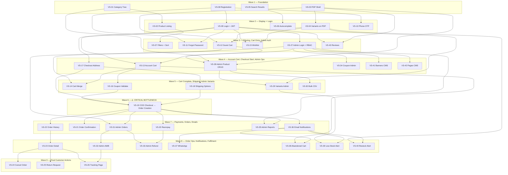

# WAVE EXECUTION PLAN

**Project:** Cloth Store E-Commerce Website  
**References:** RFP-CLOTH-ECOM-2026-001 · FDD v1.0 · ERD v1.0 · MODULE_DEPENDENCY_MAP v1.0  
**Version:** 1.0  
**Date:** June 25, 2026

---

## What Is a Wave?

A **wave** is a group of vertical slices that:
- Share **no dependencies with each other** (fully parallel inside the wave)
- Depend **only on slices from previous waves** (no stubs needed)
- Are all **merged and verified before the next wave starts**

This gives you clean merges, real code at every step, and a shippable demo at the end of each wave.

---

## Summary Table

| Wave | Slices | Max Parallel Workers | Key Output | Blocks On |
|---|---|---|---|---|
| Wave 1 | 4 | 4 | Category tree, PDP shell, Search shell, User registration | Nothing |
| Wave 2 | 5 | 5 | Product listing, Variants, Autocomplete, Login, OTP | Wave 1 |
| Wave 3 | 6 | 6 | Filters, Forgot password, Guest cart, Wishlist, Admin auth, Reviews | Wave 2 |
| Wave 4 | 6 | 6 | Account cart, Checkout address, Admin products, Coupons admin, CMS banners, CMS pages | Wave 3 |
| Wave 5 | 5 | 5 | Cart merge, Coupon validation, Shipping display, Variants admin, Bulk CSV | Wave 4 |
| Wave 6 | 1 | 1 | **COD checkout → Order creation** ← critical bottleneck | Wave 5 |
| Wave 7 | 6 | 6 | Razorpay, Order confirmation, Order history, Admin orders, Reports, Email notifications | Wave 6 |
| Wave 8 | 7 | 7 | Order detail, Admin AWB, Admin refund, WhatsApp, Abandoned cart, Low-stock, Restock | Wave 7 |
| Wave 9 | 3 | 3 | Cancel order, Return request, Shipment tracking | Wave 8 |
| **Total** | **43** | **7 peak** | Full e-commerce platform | — |

---

## The Critical Path

The longest dependency chain — this sets the **absolute minimum project duration** regardless of team size:

```
VS-08 → VS-09 → VS-12 → VS-13 → VS-16 → VS-19 → VS-22 → VS-23 → VS-24
 Register  Login  Guest  Account  Coupon   Order   History  Detail  Cancel
                  Cart    Cart   Validate  Create
```

**9 slices deep.** At 2–3 days per slice = **18–27 days minimum floor**, even with unlimited developers.

---

## Team Size vs. Duration

| Team | Full wave parallelism | Estimated Duration |
|---|---|---|
| 2 developers | No — split waves into days | ~16 weeks |
| 4 developers | Partial | ~10–11 weeks |
| **5 developers** | **Near full — recommended** | **~8–9 weeks** |
| 7 developers | Full — every wave runs at max | ~7 weeks |
| 7+ developers | No gain — Wave 6 is 1 slice, bottleneck is the critical path | Same as 7 |

---

## Wave Detail

---

### Wave 1 — Foundation (No Dependencies)

> Start Day 1. All 4 slices are fully independent. 4 developers can work in parallel.

| Slice ID | Slice Name | DB Tables Touched | UAT Cases |
|---|---|---|---|
| VS-01 | Category tree API + nav render | `CATEGORY` | TC-01, TC-02 |
| VS-03 | Product detail page — static shell | `PRODUCT`, `PRODUCT_IMAGE` | TC-12 |
| VS-05 | Search results page | `PRODUCT`, `TAG`, `PRODUCT_TAG` | TC-04, TC-05 |
| VS-08 | Email registration | `USER` | TC-48 |

**Wave 1 done when:** Category nav renders real data, a PDP loads a product, search returns results, a user can register. All 4 merged to `main`.

---

### Wave 2 — Core Display + Login (Depends on Wave 1)

> Starts when Wave 1 is fully merged.

| Slice ID | Slice Name | Depends On | DB Tables Touched | UAT Cases |
|---|---|---|---|---|
| VS-02 | Product listing page + pagination | VS-01 | `PRODUCT`, `CATEGORY` | TC-01 |
| VS-04 | Variant selector + stock on PDP | VS-03 | `PRODUCT_VARIANT` | TC-12, TC-13 |
| VS-06 | Search autocomplete (debounced) | VS-05 | `PRODUCT`, `TAG` | TC-03 |
| VS-09 | Email/password login + JWT tokens | VS-08 | `USER` | TC-50 |
| VS-10 | Phone OTP registration + login | VS-08 | `USER` | TC-49 |

**Wave 2 done when:** Products list under categories, variants update price/stock on PDP, autocomplete fires, a user can log in and get a JWT.

---

### Wave 3 — Filtering, Auth Extras, Cart Entry, Admin Auth (Depends on Wave 2)

> Peak parallelism — 6 slices, 6 developers possible.

| Slice ID | Slice Name | Depends On | DB Tables Touched | UAT Cases |
|---|---|---|---|---|
| VS-07 | Filters + sort on listing | VS-02 | `PRODUCT`, `PRODUCT_VARIANT` | TC-06 to TC-11 |
| VS-11 | Forgot password + reset link | VS-08, VS-09 | `USER` | TC-51 |
| VS-12 | Guest add-to-cart (session) | VS-03, VS-04 | `CART`, `CART_ITEM` | TC-19 |
| VS-15 | Wishlist (add / remove / move) | VS-09, VS-04 | `WISHLIST_ITEM` | TC-24 to TC-26 |
| VS-27 | Admin login + RBAC middleware | VS-09 | `USER` | TC-65, TC-79, TC-80 |
| VS-43 | Customer review submit + display | VS-09, VS-03 | `REVIEW` | TC-17 |

**Wave 3 done when:** Listing can be filtered and sorted, password reset works, a guest can add to cart, wishlist saves items, admin can log in with role enforcement, reviews submit and display.

---

### Wave 4 — Account Cart, Checkout Start, Admin Products, CMS (Depends on Wave 3)

| Slice ID | Slice Name | Depends On | DB Tables Touched | UAT Cases |
|---|---|---|---|---|
| VS-13 | Account cart — server-persisted | VS-09, VS-12 | `CART`, `CART_ITEM` | TC-18 |
| VS-17 | Checkout Step 1 — address select/add | VS-09 | `ADDRESS` | TC-30, TC-31, TC-32 |
| VS-28 | Admin product CRUD + image upload | VS-27, VS-01, VS-03 | `PRODUCT`, `PRODUCT_IMAGE`, `CATEGORY` | TC-66, TC-67 |
| VS-34 | Coupon + campaign CRUD (admin) | VS-27 | `COUPON`, `CAMPAIGN`, `CAMPAIGN_PRODUCT` | TC-74, TC-75 |
| VS-41 | Homepage banners CMS | VS-27 | `BANNER` | TC-76 |
| VS-42 | Static pages CMS | VS-27 | `PAGE` | TC-77 |

**Wave 4 done when:** Logged-in cart persists across devices, checkout shows address step, admin can create/edit products and coupons, banners and pages editable in admin.

---

### Wave 5 — Cart Completion, Shipping, Admin Variants (Depends on Wave 4)

| Slice ID | Slice Name | Depends On | DB Tables Touched | UAT Cases |
|---|---|---|---|---|
| VS-14 | Guest → account cart merge on login | VS-12, VS-13 | `CART`, `CART_ITEM` | TC-20 |
| VS-16 | Coupon validate in cart | VS-13 | `COUPON`, `COUPON_USAGE` | TC-27, TC-28, TC-29 |
| VS-18 | Checkout Step 2 — shipping options | VS-17 | _(config-based, no new table)_ | TC-33 |
| VS-29 | Admin variant + stock management | VS-28, VS-04 | `PRODUCT_VARIANT` | TC-68 |
| VS-30 | Bulk CSV product import / export | VS-28 | `PRODUCT`, `PRODUCT_VARIANT` | TC-69, TC-70 |

**Wave 5 done when:** Cart merge works on login, coupon codes apply correctly, shipping options show at checkout Step 2, admin can edit variant stock, bulk import creates products.

---

### Wave 6 — THE CRITICAL BOTTLENECK (Depends on Wave 5)

> **One slice. Entire team blocks until this is done. Put your best developer on it.**

| Slice ID | Slice Name | Depends On | DB Tables Touched | UAT Cases |
|---|---|---|---|---|
| VS-19 | COD checkout → Order creation + GST invoice PDF | VS-16, VS-17, VS-18 | `ORDER`, `ORDER_ITEM`, `COUPON_USAGE`, `PAYMENT` | TC-36, TC-38 |

**Why it's the bottleneck:** Every downstream slice — order history, admin orders, refunds, notifications, reports, tracking — depends on an `ORDER` record existing. Nothing in Wave 7, 8, or 9 can be built until VS-19 is real and merged.

**Wave 6 done when:** A customer can complete a COD checkout end-to-end, an ORDER row is created in the DB with correct GST, and a PDF invoice is generated and downloadable.

---

### Wave 7 — Payments, Order Visibility, Notifications Foundation (Depends on Wave 6)

| Slice ID | Slice Name | Depends On | DB Tables Touched | UAT Cases |
|---|---|---|---|---|
| VS-20 | Razorpay online payment + webhook | VS-19 | `PAYMENT` | TC-34, TC-35, TC-37 |
| VS-21 | Order confirmation page + email trigger | VS-19 | `ORDER` | TC-38, TC-39, TC-40 |
| VS-22 | Customer order history list | VS-19 | `ORDER` | TC-41 |
| VS-31 | Admin order list + status update | VS-27, VS-19 | `ORDER`, `ORDER_STATUS_HISTORY` | TC-71 |
| VS-35 | Admin sales + bestseller reports | VS-27, VS-19 | `ORDER`, `ORDER_ITEM` | TC-78 |
| VS-36 | Email notification system (all order events) | VS-19 | _(stateless — reads USER.email)_ | TC-81, TC-82 |

**Wave 7 done when:** Online Razorpay payment works in test mode, order confirmation email fires, customer can see their orders, admin can update order status, reports show real data, emails are delivered.

---

### Wave 8 — Order Operations, All Notifications, Admin Fulfilment (Depends on Wave 7)

| Slice ID | Slice Name | Depends On | DB Tables Touched | UAT Cases |
|---|---|---|---|---|
| VS-23 | Order detail + status timeline | VS-22 | `ORDER`, `ORDER_STATUS_HISTORY` | TC-42 |
| VS-32 | Admin — add AWB + mark shipped | VS-31 | `SHIPMENT` | TC-72 |
| VS-33 | Admin — process Razorpay refund | VS-31, VS-20 | `REFUND` | TC-33 (admin) |
| VS-37 | WhatsApp notifications | VS-36 | _(stateless)_ | TC-40, TC-82 |
| VS-38 | Abandoned cart email sequence (cron) | VS-13, VS-36 | `ABANDONED_CART_EMAIL` | TC-62, TC-63, TC-64 |
| VS-39 | Low-stock admin alert | VS-29, VS-36 | `PRODUCT_VARIANT` | TC-83 |
| VS-40 | Restock "Notify Me" + customer alert | VS-04, VS-36 | `RESTOCK_ALERT` | TC-47, TC-84 |

**Wave 8 done when:** Order detail page shows full status timeline, admin can mark orders shipped with AWB, refunds process via Razorpay, WhatsApp messages fire, abandoned cart cron runs, stock alerts work.

---

### Wave 9 — Final Customer Order Actions (Depends on Wave 8)

| Slice ID | Slice Name | Depends On | DB Tables Touched | UAT Cases |
|---|---|---|---|---|
| VS-24 | Customer cancel order | VS-23 | `ORDER`, `ORDER_STATUS_HISTORY` | TC-43, TC-44 |
| VS-25 | Customer return request + admin approve | VS-23 | `ORDER`, `ORDER_STATUS_HISTORY` | TC-46 |
| VS-26 | Shipment tracking page | VS-23, VS-32 | `SHIPMENT` | TC-45 |

**Wave 9 done when:** Customer can cancel eligible orders, return requests are submitted and admin-actionable, tracking page shows live AWB status.

---

## Merge Rules (apply to every wave)

1. **All slices in a wave must be merged before Wave N+1 starts.** No exceptions.
2. **One person owns DB migrations.** All schema changes go through them as a single PR reviewed before the wave begins.
3. **One feature branch per slice.** Naming: `feature/vs-01-category-tree`. Merged via PR only.
4. **Each PR must pass its UAT cases** (listed per slice above) before merge is approved.
5. **No slice may call another slice in the same wave directly.** If you find a dependency within a wave, it means the wave was split incorrectly — raise it immediately.

---

## Dependency Graph (all 43 slices)



---

## Next Step

Detail each slice individually with:
- Exact API endpoints
- DB tables read/written
- Acceptance criteria (from UAT doc)
- Stub interface (what it fakes from previous waves while being developed in isolation during testing)

---

*Wave Execution Plan v1.0 — June 25, 2026*  
*Next document: VERTICAL_SLICES_DETAIL_Cloth_Store_Website.md*
